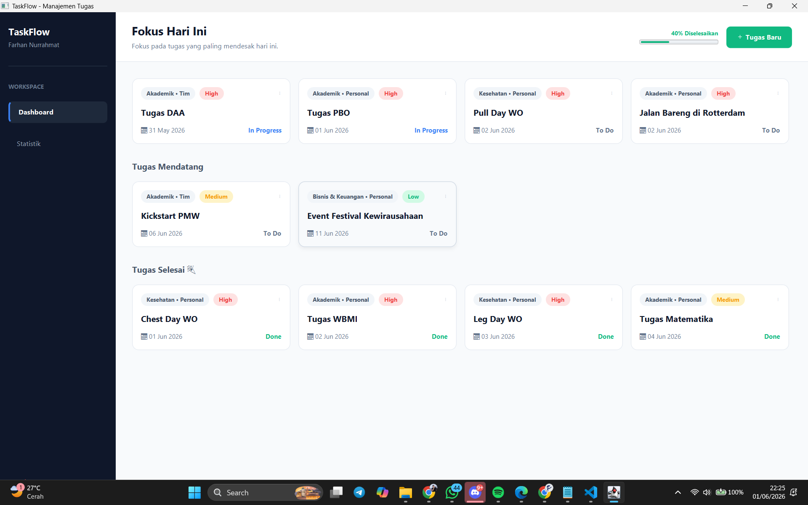
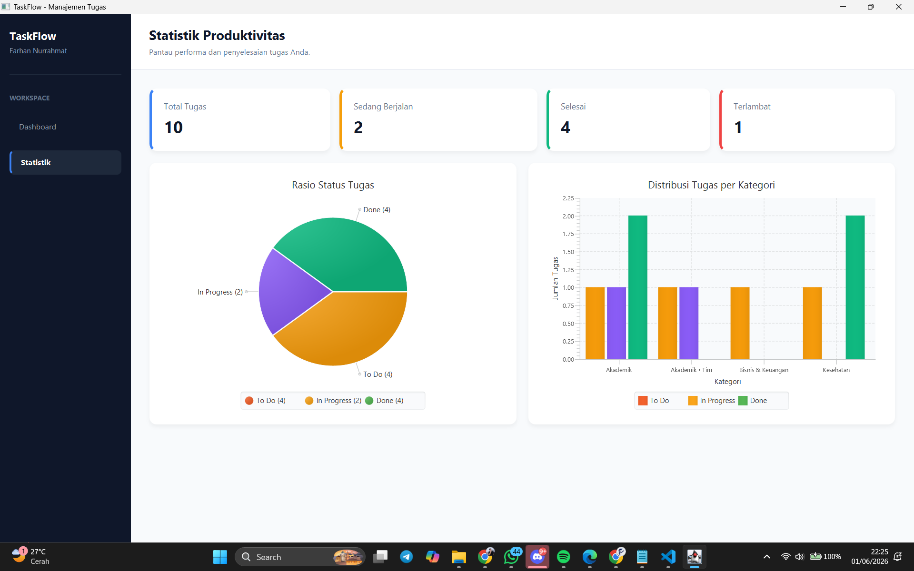

# 🚀 TaskFlow

**TaskFlow** adalah aplikasi manajemen tugas pribadi berbasis JavaFX yang dirancang untuk membantu pengguna mengatur aktivitas sehari-hari secara lebih terstruktur. Aplikasi ini memungkinkan pengguna mencatat tugas, menentukan prioritas, memantau progres pekerjaan, serta melihat statistik produktivitas melalui antarmuka desktop yang sederhana, modern, dan mudah digunakan.

TaskFlow tidak hanya berfungsi sebagai daftar tugas biasa, tetapi juga membantu pengguna memfokuskan perhatian pada tugas yang paling penting berdasarkan prioritas dan tenggat waktu yang dimiliki.

---

# 🎯 Latar Belakang

Dalam kehidupan perkuliahan, mahasiswa sering kali harus mengelola banyak aktivitas secara bersamaan, mulai dari tugas akademik, kegiatan organisasi, proyek, hingga aktivitas pribadi. Ketika jadwal semakin padat, tugas yang penting sering terlupakan, menumpuk, atau bahkan melewati tenggat waktu yang telah ditentukan.

Berangkat dari permasalahan tersebut, TaskFlow dikembangkan sebagai aplikasi manajemen tugas pribadi yang membantu pengguna mengelompokkan pekerjaan, menentukan prioritas, serta memantau perkembangan tugas secara lebih efektif. Dengan adanya sistem pengelolaan yang terstruktur, pengguna dapat meningkatkan produktivitas dan membangun kebiasaan manajemen waktu yang lebih baik.

---

# ✨ Fitur Utama

## 🔐 Sistem Autentikasi

* Registrasi akun pengguna
* Login pengguna
* Validasi data masukan
* Penyimpanan data pengguna secara lokal

## 📋 Manajemen Tugas

* Menambahkan tugas baru
* Mengedit tugas yang sudah ada
* Menghapus tugas
* Menentukan kategori tugas
* Menentukan prioritas tugas
* Menentukan tanggal tenggat waktu

## 🏷️ Klasifikasi Personal & Tim

TaskFlow menyediakan dua jenis konteks tugas:

* **Personal** → Tugas individu atau aktivitas pribadi.
* **Tim** → Tugas yang berasal dari kelompok, organisasi, atau proyek bersama.

Fitur ini membantu pengguna membedakan sumber pekerjaan tanpa mengubah fokus utama aplikasi sebagai manajemen tugas pribadi.

## ⚡ Prioritas dan Fokus Harian

Tugas secara otomatis dikelompokkan berdasarkan tingkat urgensinya sehingga pengguna dapat lebih mudah mengetahui pekerjaan yang perlu diprioritaskan terlebih dahulu.

Kategori prioritas:

* High
* Medium
* Low

## 📈 Pemantauan Status Tugas

Setiap tugas dapat berada pada salah satu status berikut:

* To Do
* In Progress
* Done

Status ini memudahkan pengguna untuk memantau perkembangan pekerjaan secara berkala.

## 📊 Statistik Produktivitas

Aplikasi menyediakan visualisasi data untuk membantu pengguna memahami progres pekerjaannya melalui:

* Pie Chart distribusi status tugas
* Bar Chart distribusi kategori tugas
* Ringkasan tingkat penyelesaian tugas

## 💾 Penyimpanan Lokal

Seluruh data disimpan menggunakan database SQLite sehingga aplikasi tetap ringan, cepat, dan dapat digunakan tanpa koneksi internet.

---

# 🛠️ Teknologi yang Digunakan

| Teknologi | Kegunaan                            |
| --------- | ----------------------------------- |
| Java      | Bahasa pemrograman utama            |
| JavaFX    | Pengembangan antarmuka pengguna     |
| SQLite    | Penyimpanan data lokal              |
| JDBC      | Koneksi database                    |
| Gradle    | Build automation                    |
| Git       | Version Control                     |
| GitHub    | Kolaborasi dan manajemen repositori |

---

# 🏗️ Arsitektur Aplikasi

TaskFlow dibangun menggunakan pendekatan pemisahan tanggung jawab (Separation of Concerns) agar kode lebih mudah dipelihara dan dikembangkan.

Layer utama:

* Model
* View
* Controller
* Service
* DAO (Data Access Object)
* Database

---

# 🧠 Implementasi Object-Oriented Programming (OOP)

## Encapsulation

Data pengguna dan tugas disimpan dalam atribut yang terlindungi dan diakses melalui method yang sesuai.

Contoh:

* User.java
* BaseTask.java

## Abstraction

Kelas abstrak digunakan untuk mendefinisikan karakteristik umum sebuah tugas.

Contoh:

* BaseTask.java

## Inheritance

Kelas tugas turunan mewarisi atribut dan perilaku dari kelas induk.

Contoh:

* PersonalTask.java
* TeamTask.java

## Polymorphism

Objek tugas dapat diproses secara fleksibel tanpa bergantung pada tipe tugas secara spesifik.

---

# 📂 Struktur Proyek

```plaintext
app/src/main/java/com/taskflow/
│
├── Main.java
│
├── config/
│   └── DatabaseConfig.java
│
├── model/
│   ├── User.java
│   ├── BaseTask.java
│   ├── PersonalTask.java
│   └── TeamTask.java
│
├── dao/
│   ├── UserDAO.java
│   └── PersonalTaskDAO.java
│
├── service/
│   └── AuthService.java
│
├── controller/
│   ├── LoginController.java
│   ├── DashboardController.java
│   └── StatisticsController.java
│
├── util/
│   └── SceneManager.java
│
└── view/
    ├── LoginView.java
    ├── DashboardView.java
    └── StatisticsView.java
```

---

# ▶️ Cara Menjalankan

## Prasyarat

* Java JDK 21 atau lebih baru
* Gradle 9.x atau Gradle Wrapper bawaan proyek

## Windows

```bash
.\gradlew run
```

## Linux / macOS

```bash
chmod +x gradlew
./gradlew run
```

---

# 🌿 Git Workflow

Pengembangan proyek menggunakan dua branch utama:

## develop

Branch yang digunakan untuk:

* Pengembangan fitur baru
* Perbaikan bug
* Pengujian aplikasi
* Kolaborasi tim

## main

Branch yang berisi versi stabil dan siap dipresentasikan atau digunakan.

---

# 📸 Tampilan Aplikasi

### Dashboard



### Statistik




# 🎓 Tujuan Pengembangan

Proyek ini dikembangkan sebagai bagian dari implementasi pembelajaran Pemrograman Berorientasi Objek (Object-Oriented Programming) dengan tujuan menerapkan konsep-konsep OOP ke dalam pengembangan aplikasi desktop yang memiliki manfaat nyata dalam kehidupan sehari-hari.

---

# 👥 Tim Pengembang

* Muhammad Farhan Nurrahmat Latif
* Muhammad Syahdan
* Muhammad Sofwaturrohman

---

# 📄 Lisensi

Proyek ini dibuat untuk keperluan akademik dan pembelajaran.
